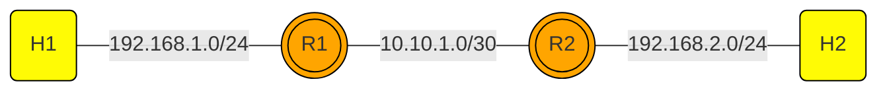
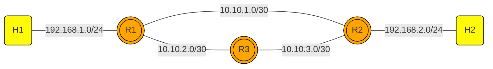

# NET101
NET101 is a repository to learn about network from traditional to programmable network using mininet environment.

## Requirement
You need to install mininet on your Ubuntu Linux Server. To install mininet you can just go to the repository and clone it to your linux locally.

```
    git clone https://github.com/mininet/mininet.git
    cd mininet
    ./util/install.sh -a 
```
## Static and Dynamic Routing




